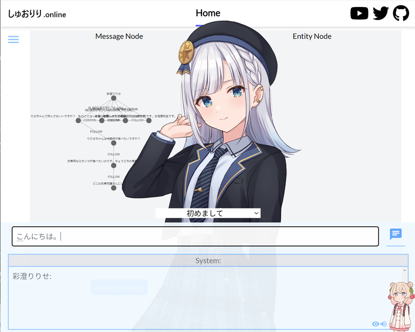
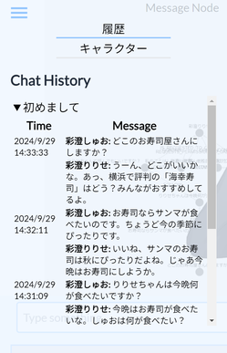
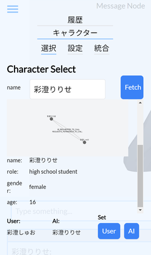
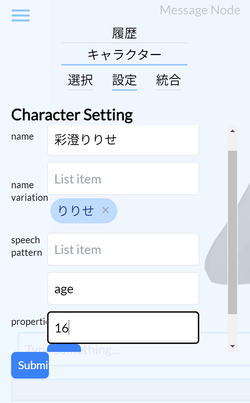
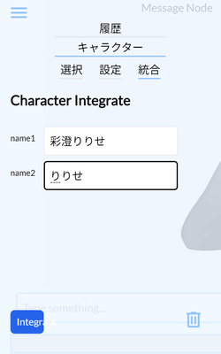

# About this repository
- LLMの長期記憶として、Knowledge Graphを利用しようと試みたプロジェクトのフロントエンドです。
- 概要については、[こちら](https://github.com/hina02/ririse02)のバックエンドレポジトリを参照してください。
- 実行には、.envファイルが必要です。  
'VITE_BACKEND_URL=http://127.0.0.1:8000'を設定してください。
- 開発環境での実行しか確認していないため、'npm install', 'npm run dev'で実行してください。  

# 初期設定
ハンバーガーメニュー　＞　キャラクター　＞　設定で、以下の初期キャラクターを設定してください。  
name: 彩澄りりせ　key: age value:16  
name: 彩澄しゅお　key: age value:10  

# 画面説明
## メイン画面
タイトルを選択して、メッセージを入力して、メッセージアイコンを押すと、レスポンスが生成されます。  
ハンバーガーメニューから、会話履歴の表示及びキャラクター設定ができます。
右下の目のアイコンとボイスのアイコンで、それぞれキャラクターの表示と音声合成を切り替えることができます。  
（音声合成には、VoicePeakが必要です。）

## 履歴
- 会話タイトルごとに、会話履歴が表示されます。  
　会話履歴を読み込むと、会話履歴で使用されたノードとリレーションシップがMessage Node欄に描画されます。

## キャラクター
- 選択
　Fetch: キャラクターの情報を取得します。  
　Set: Fetchで表示したキャラクターを、会話のキャラクター情報として設定します。（User, AI）  

- 設定
　キャラクター設定を作成、編集します。  
　name variation: あだ名のバリエーションです。（バリエーションに該当するものは、このノードに紐づけられます）  
　speech pattern: 口癖のパターンです。入力してEnterしてください。  
　properties: その他の設定です。キーバリュー形式で渡します。入力してAddボタンを押してください。  

- 統合
	二つの名称のキャラクターのノード及びリレーションシップを統合します。  
    name1が主となり、name2のプロパティ、リレーションシップがname1に紐づけられます。name2は名前のバリエーションとして取り込まれます。  
	不要となったノードは、ゴミ箱アイコンから、削除できます。  

